# 周边可视化系统 · 使用说明书（图文详解版）

> 面向使用者的完整操作手册。不讲技术，照着图一步步做即可上手。
> **系统是做什么的**：把公司做过的**周边项目、采购价格、供应商、设计灵感、避坑经验**统一存起来，随时查询、对比、复用，避免重复踩坑、帮助采购砍价。

---

## 目录

- [第一章 快速开始](#第一章-快速开始)
  - [1.1 登录系统](#11-登录系统)
  - [1.2 认识界面](#12-认识界面)
  - [1.3 全局搜索（最常用）](#13-全局搜索最常用)
- [第二章 首页总览](#第二章-首页总览)
- [第三章 历史项目库](#第三章-历史项目库)
- [第四章 价格相关](#第四章-价格相关)
  - [4.1 历史价格记录库](#41-历史价格记录库)
  - [4.2 价格查询与报价审核](#42-价格查询与报价审核)
- [第五章 灵感库（重点）](#第五章-灵感库重点)
  - [5.1 浏览与筛选](#51-浏览与筛选)
  - [5.2 新增灵感（粘链接自动抓取）](#52-新增灵感粘链接自动抓取)
  - [5.3 查看详情与大图](#53-查看详情与大图)
  - [5.4 删除、撤回与回收站](#54-删除撤回与回收站)
- [第六章 设计/生产注意事项](#第六章-设计生产注意事项)
- [第七章 供应商](#第七章-供应商)
  - [7.1 供应商库](#71-供应商库)
  - [7.2 供应商评分看板](#72-供应商评分看板)
- [第八章 系统管理](#第八章-系统管理)
  - [8.1 批量导入](#81-批量导入)
  - [8.2 标签管理](#82-标签管理)
  - [8.3 权限管理](#83-权限管理)
  - [8.4 操作日志](#84-操作日志)
  - [8.5 流量监控](#85-流量监控)
  - [8.6 AI 配置](#86-ai-配置)
- [第九章 访客检索页](#第九章-访客检索页)
- [第十章 常用技巧与权限说明](#第十章-常用技巧与权限说明)

---

## 第一章 快速开始

### 1.1 登录系统
打开系统网址，输入**用户名**和**密码**，点「登 录」即可。
- 没有账号或忘记密码，请联系管理员开通。
- 不同账号能看到、能操作的范围不同（详见 [第十章](#第十章-常用技巧与权限说明)）。

### 1.2 认识界面
登录后进入首页，界面分三块：

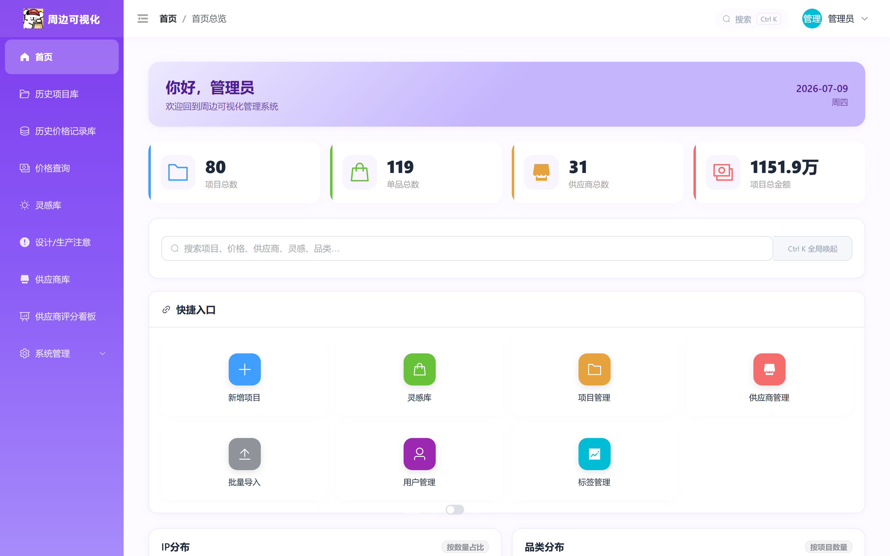

- **左侧菜单**：所有功能入口。最上方图标可收起/展开菜单；最下方有主题（浅色/深色）开关。
- **顶部栏**：左边显示当前所在页面（面包屑），中间「搜索」按钮，右上角头像（点开可退出登录）。
- **中间区域**：当前功能内容。首页这里是数据总览 + 快捷入口九宫格。

### 1.3 全局搜索（最常用）
点顶部「搜索」按钮，或直接按键盘 **Ctrl + K**（Mac 为 ⌘+K），弹出搜索框，一次可跨**项目、价格、供应商、灵感、品类**搜索。

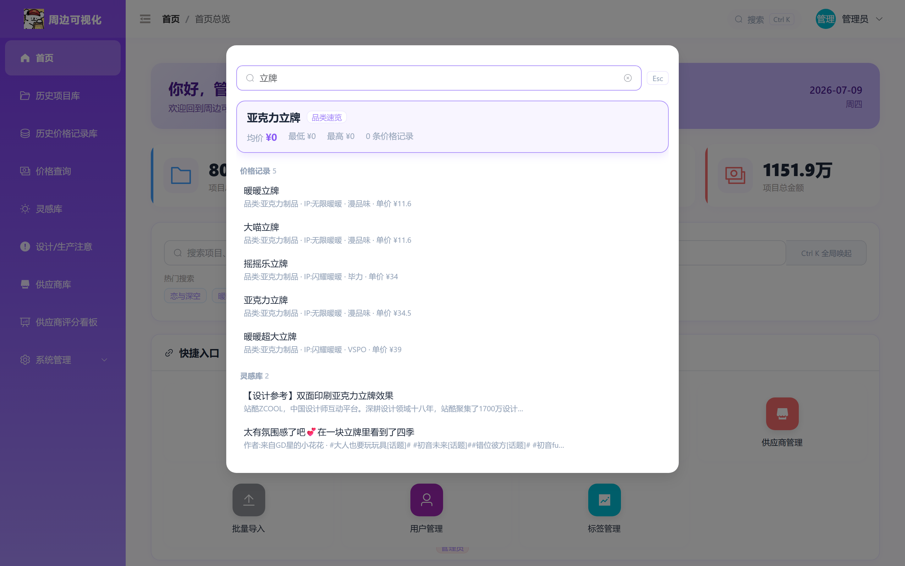

如上图，搜「立牌」会同时返回品类速览、相关价格记录、设计参考等。适合"记得做过类似的但忘了在哪"的场景。

---

## 第二章 首页总览

一进系统看到的总览页（见 1.2 配图）。包含：
- **顶部欢迎栏**：显示你的名字和当前日期。
- **四个数字卡**：项目总数、单品总数、供应商总数、项目总金额。
- **快捷入口九宫格**：新增项目、灵感库、项目管理、供应商管理、批量导入、用户管理、标签管理等一键直达。
- **下方图表**：IP 分布、品类分布饼图，供应商/品类排行榜，最近更新记录。

首页只看不填，用来快速掌握整体情况。

---

## 第三章 历史项目库

**公司做过的周边项目都在这里。**

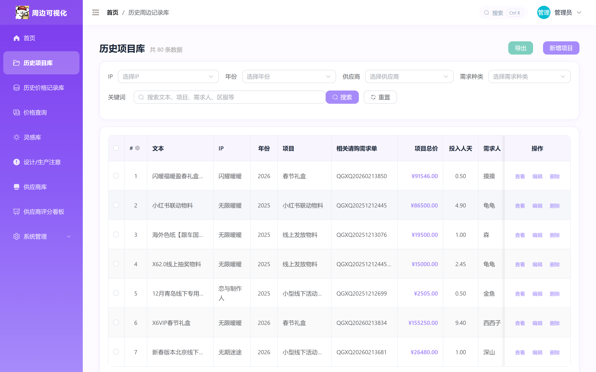

**怎么查**：上方有 IP、年份、供应商、需求种类下拉筛选，右侧关键词框可搜项目名/需求人/区服等，点「搜索」，点「重置」清空。

**主要操作**：
- **看详情**：每行右侧「查看」。
- **新增**：右上角「新增项目」，填项目名、IP、年份、总价、投入人天、供应商、起止日期、负责人、报价单图等。
- **编辑 / 删除**：每行「编辑」「删除」。
- **导出**：勾选左侧复选框选中若干行 → 底部出现批量栏 → 「批量导出」；或右上角「导出」直接导出。
- **调整显示列**：表格右上角齿轮图标，可显示/隐藏列。
- **分页**：底部可切每页 10/20/50/100 条。

---

## 第四章 价格相关

### 4.1 历史价格记录库
**每一笔周边的报价明细都存在这里**，是价格查询的数据来源。

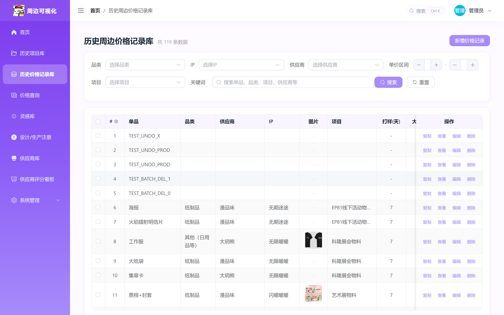

**主要操作**：
- **筛选**：品类、IP、供应商、单价区间、项目下拉 + 关键词。
- **新增 / 编辑 / 删除**：右上角「新增价格记录」；每行「编辑」「删除」。
- **复制**：每行「复制」，一键把单品/品类/供应商/IP/单价/数量/总价复制到剪贴板，方便粘贴到别处。
- **批量导出**：勾选后批量导出。
- 表单填：单品、品类、供应商、IP、单价、数量、打样/大货天数、设计费、打样费、总价等。

### 4.2 价格查询与报价审核
分两个标签页，是**采购砍价的利器**。

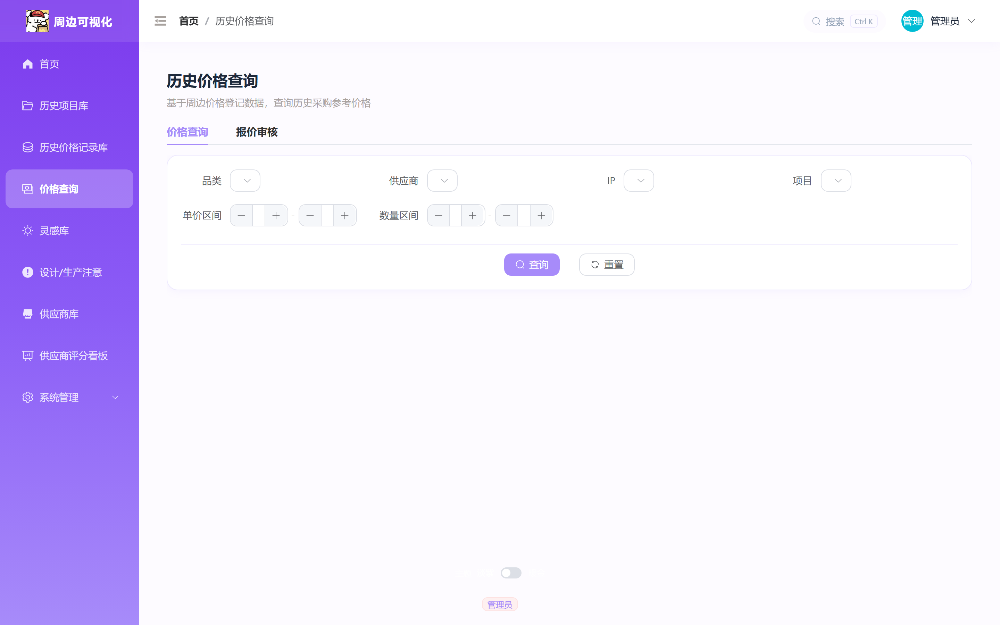

**Tab 1「价格查询」**——想知道某类东西历史什么价：
选品类/供应商/IP/数量区间 → 点「查询」，得到：
- 历史**最高价、最低价、平均价、匹配数量**四个数字卡；
- **不同供应商价格对比表**（谁贵谁便宜一目了然）；
- 命中的**明细列表**。

**Tab 2「报价审核」**——供应商给了报价，判断贵不贵：

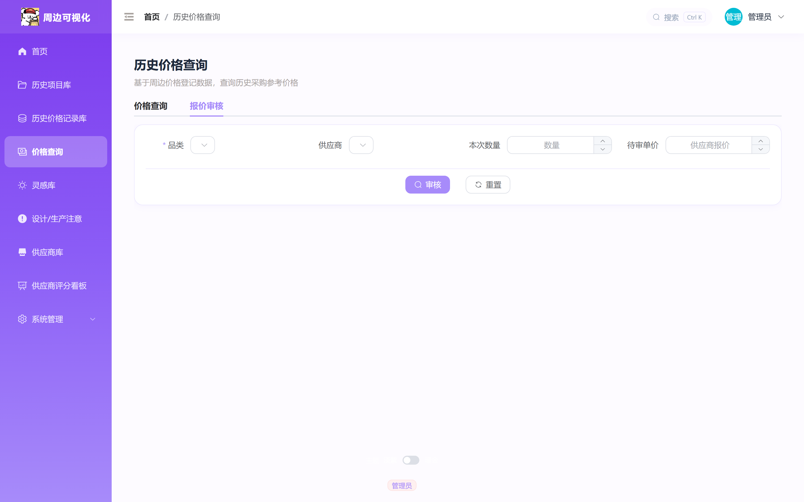

选品类（必填）、填本次数量和待审单价 → 点「审核」，系统告诉你：
- 这个报价**比历史均价高/持平/低**，差多少百分比；
- 按**相近数量**再校准一次（量不同价不同）；
- 同供应商历史、同品类其它供应商报价对比。

> 用途：谈价、评估报价是否合理时，先来这里过一遍。

---

## 第五章 灵感库（重点）

**存工艺灵感、参考案例的地方**，支持小红书、B站、淘宝、1688、站酷、微博等链接。

### 5.1 浏览与筛选

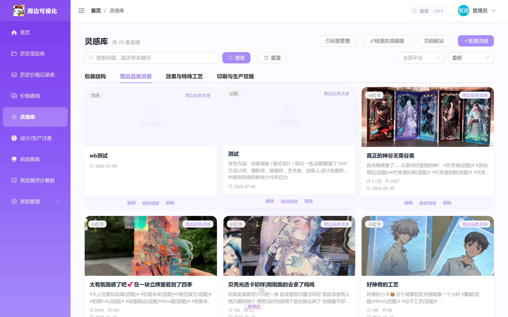

- **分类浏览**：上方 4 个标签页——包装结构 / 周边品类灵感 / 效果与特殊工艺 / 印刷与生产攻略。
- **搜索排序**：关键词框 + 平台筛选（小红书/B站/淘宝…）+ 排序（最新/最热/播放最多/点赞最多/收藏最多）。
- **卡片信息**：每张卡片展示封面、平台标签、标题、标签、互动数据（播放/点赞/收藏）、日期。卡片下方有「编辑」「跳转链接」「删除」。

### 5.2 新增灵感（粘链接自动抓取）
右上角「新增灵感」打开表单：

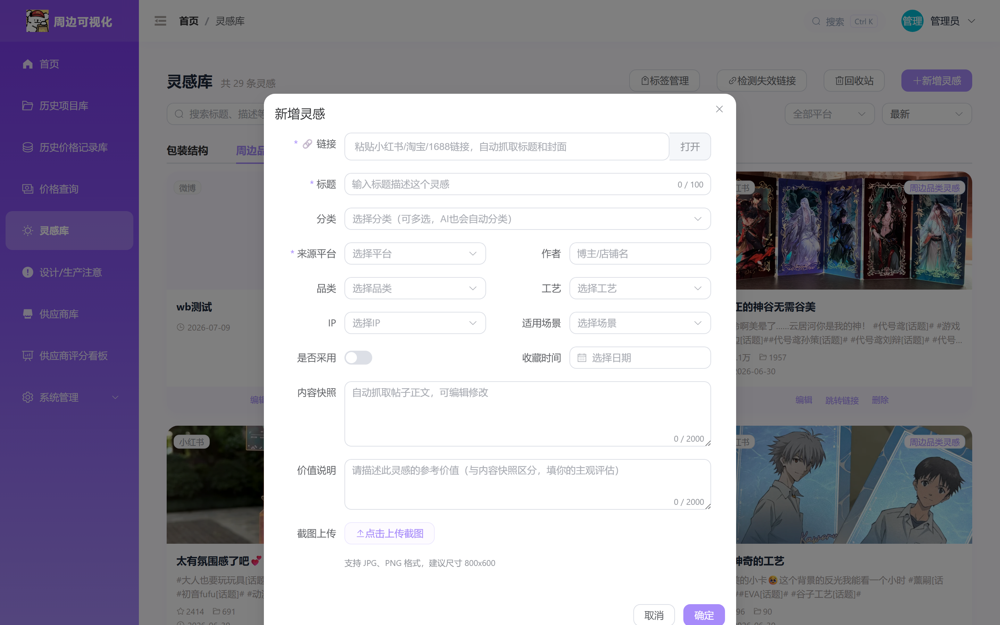

**最省事的用法**：把链接粘到最上方的「链接」框里，系统会**自动抓取标题、封面、简介、点赞/收藏/播放数，并自动匹配 IP 等标签**。
- 支持小红书、B站视频等。
- 淘宝/1688/站酷/微博等登录墙平台抓不到内容，按提示**上传截图**即可（标题会留空让你手填）。
- 抓取的内容可以再手动修改。

### 5.3 查看详情与大图
点卡片打开详情弹窗：

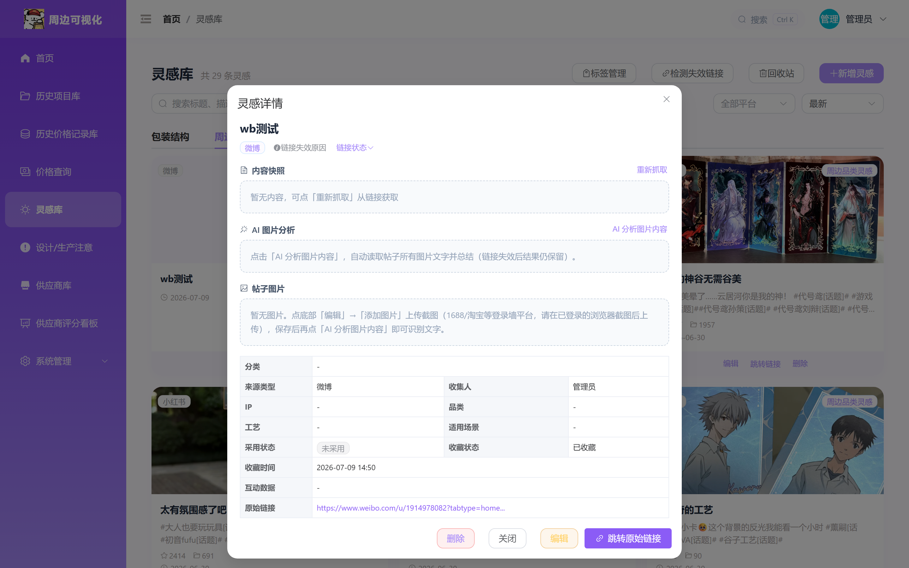

详情里能看：内容快照、AI 图片分析结果、帖子图片、分类/来源/IP/工艺/收藏时间、**完整互动数据（播放·点赞·收藏·评论）**、原始链接。
- 点图片可**放大**看大图；大图打开时，**点周围空白处关闭大图，再点空白关详情**（也可按 ESC）。

### 5.4 删除、撤回与回收站
- **删了能反悔**：删除灵感后，**右上角会弹出一个"撤回"按钮，10 秒内点它即可恢复**。
- **回收站**：右上角「回收站」按钮，能看到所有已删灵感，可逐条「恢复」或「彻底删除」。
- 顶部还有「标签管理」（管理灵感用的标签）和「检测失效链接」（批量检查链接是否还有效）两个按钮。

---

## 第六章 设计/生产注意事项

**避坑经验库**——把踩过的坑和正确做法记下来，供后人参考。

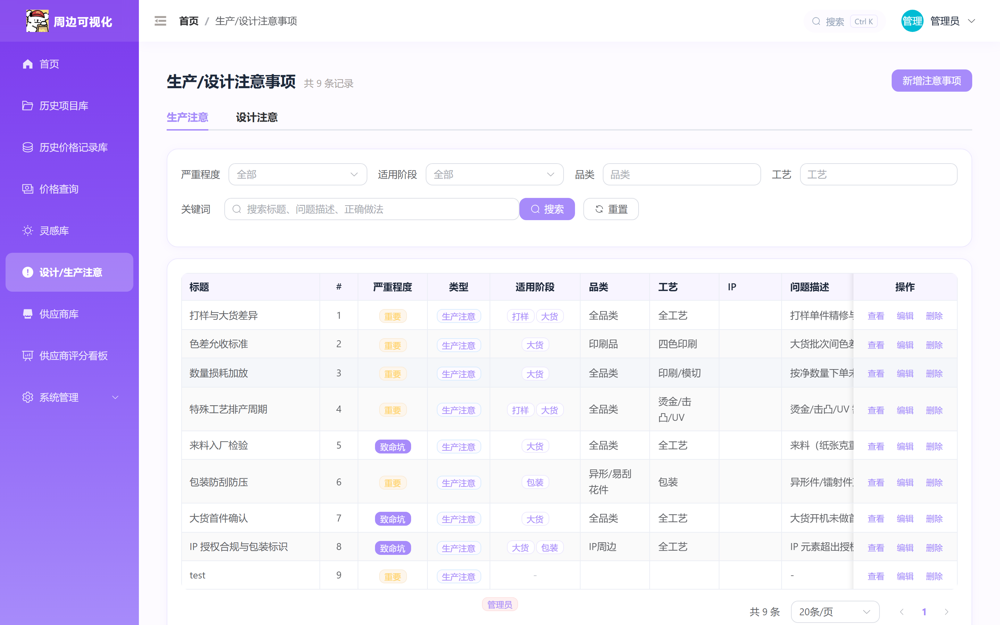

- 上方 2 个标签页：生产注意 / 设计注意。
- **筛选**：严重程度（致命坑/重要/建议）、适用阶段（设计/打样/大货/包装）、品类、工艺、关键词。
- **新增**：「新增注意事项」，填标题、严重程度、适用阶段、品类、工艺、IP、问题描述、正确做法、图片、附件。
- 每行有「查看」「编辑」「删除」。

---

## 第七章 供应商

### 7.1 供应商库
**所有供应商档案。**

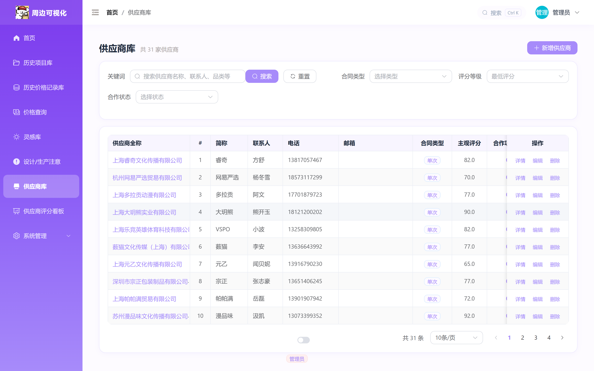

- **筛选**：关键词、合同类型、评分等级、合作状态。
- **新增**：「新增供应商」，填名称、简称、联系人、电话、邮箱、合同类型、评分、合作状态、做过的品类、优势品类、风险备注。
- 每行「详情」「编辑」「删除」，点行也能打开详情。

### 7.2 供应商评分看板
**供应商表现的图表总览（只看不填）。**

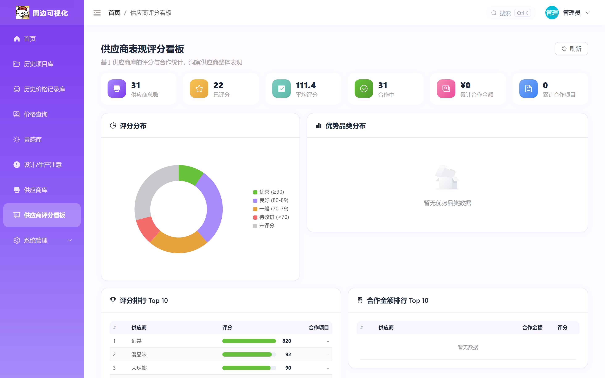

- 6 张数字卡：总数、已评分、平均分、合作中、累计金额、累计项目数。
- 评分分布饼图、优势品类分布图。
- 评分 Top 10、合作金额 Top 10 排行榜。
- 右上角可「刷新」。

---

## 第八章 系统管理

左侧菜单「系统管理」展开后包含以下几项（多为管理员使用）。

### 8.1 批量导入
**用 Excel 一次导入大量数据。**

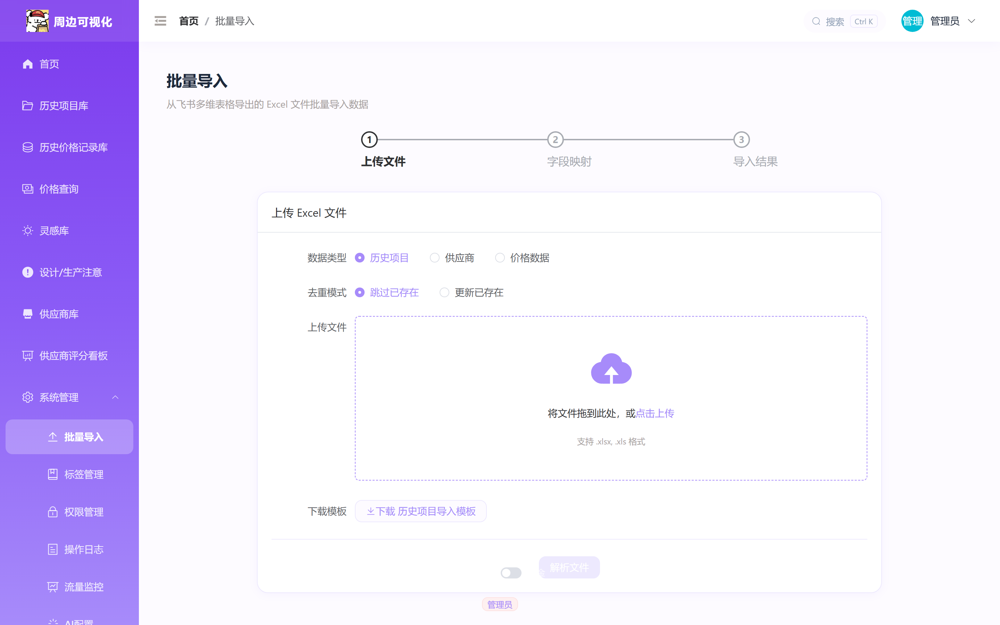

三步走：
1. 选**数据类型**（项目/供应商/价格）和**去重方式**（跳过已存在 / 更新已存在）；
2. 先「下载模板」按模板填好，再上传文件 → 「解析文件」；
3. 核对字段映射 → 「开始导入」；最后看结果（成功/失败/跳过数量，失败会列出原因）。

### 8.2 标签管理
**统一管理 IP / 品类 / 工艺 / 场景四类标签。**

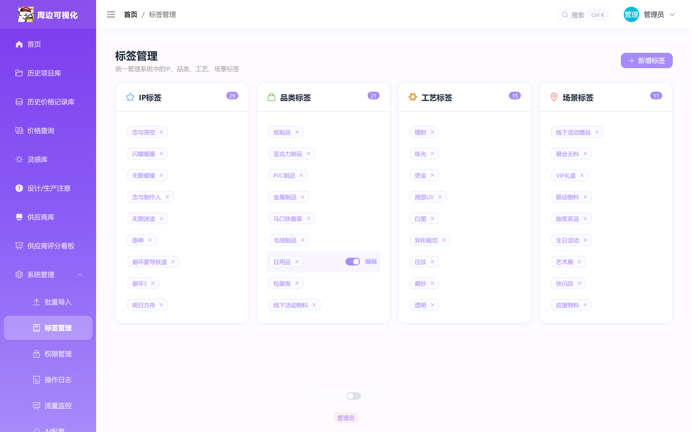

- 4 张分类卡，每类里可新增、编辑、启用/禁用、删除标签。
- 灵感库、项目库用到的标签都来自这里。

### 8.3 权限管理
**管理员分配谁能用哪些功能。**

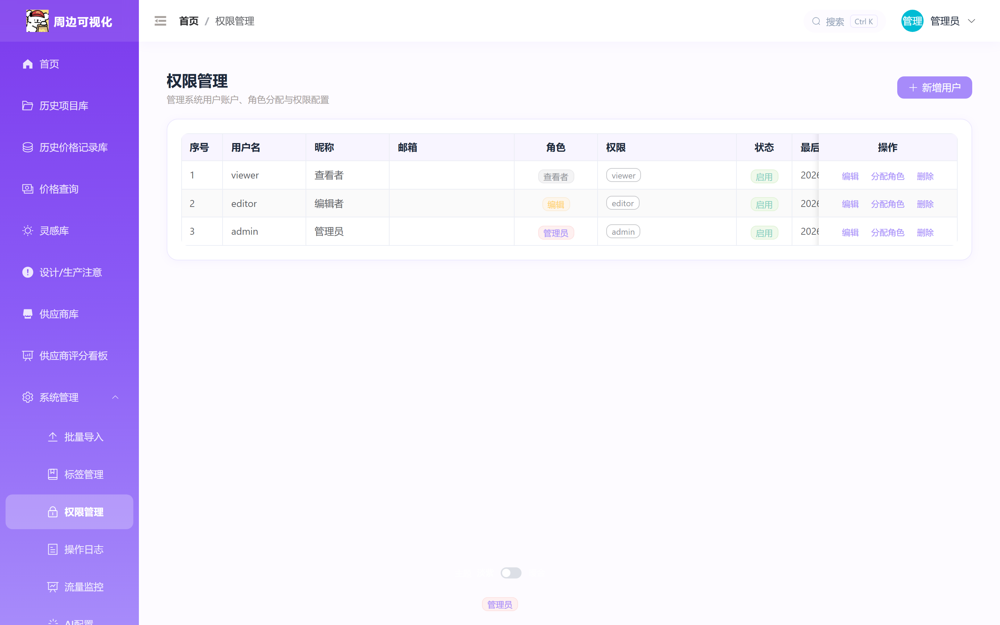

普通用户一般用不到。管理员在此为不同角色勾选可用功能。

### 8.4 操作日志
**谁在什么时候做了什么，都有记录。**

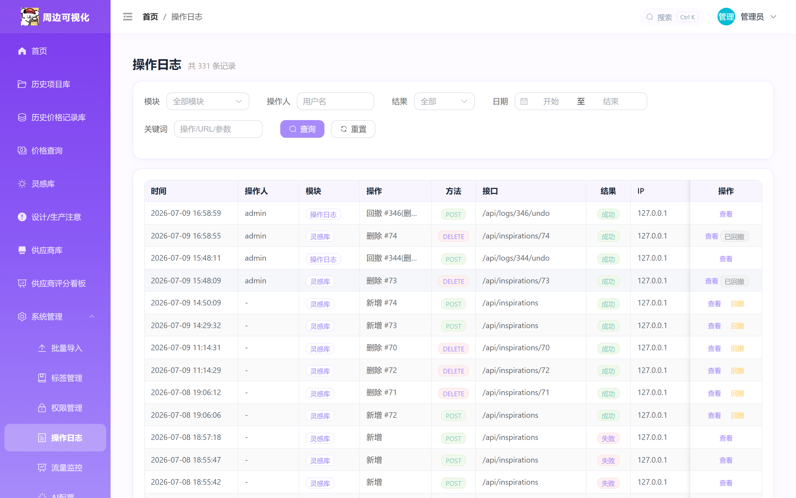

- 可按模块、时间筛选。
- **误删的数据可以在这里找到并「回撤」恢复**（灵感、项目、价格等都支持）。

### 8.5 流量监控
系统访问情况统计（管理员用）。

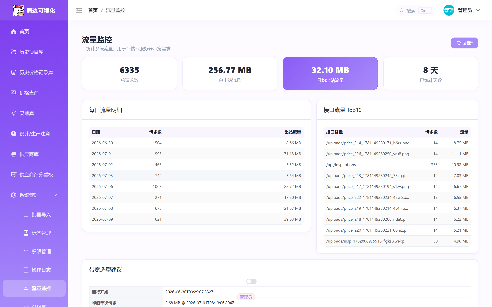

### 8.6 AI 配置
**设置两样东西：**

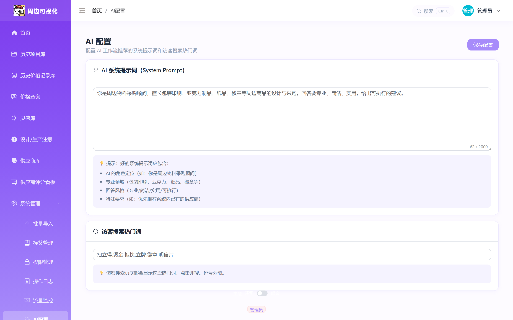

- **AI 系统提示词**：决定"访客检索页"里 AI 推荐的说话风格和专业方向。
- **访客搜索热门词**：逗号分隔，会显示在访客页底部作为搜索热词。
- 改完点上方「保存」，即时生效。

---

## 第九章 访客检索页

给**没有系统账号的人**用的简化搜索页（网址带 `/visitor`）。

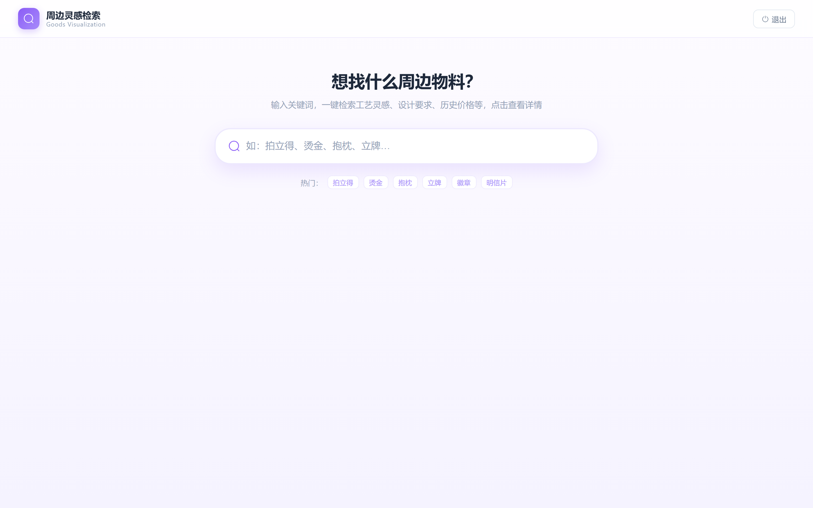

- 一个大搜索框，输关键词即可搜全站内容（灵感、项目、价格、供应商、注意事项）。
- 下方有热门词标签可直接点。
- 「获取工作流推荐」按钮：AI 会根据搜索内容，给一套**从设计到采购的建议**（能看到 AI 实时思考过程）。
- 搜索结果点开可看详情。

---

## 第十章 常用技巧与权限说明

### 常用技巧
- **快速找东西**：随时按 Ctrl+K 全局搜，比进具体页面再筛更快。
- **存灵感最省事**：直接粘链接，标题/封面/标签自动带出，不用手打。
- **删错别慌**：灵感删除 10 秒内右上角能撤回；过时间去「回收站」恢复；其它数据去「操作日志」回撤。
- **砍价前**：先去「价格查询 → 报价审核」，输入品类和对方报价，立刻知道贵不贵。
- **批量录入**：几十上百条老数据用「批量导入」+ Excel 模板，别一条条加。

### 谁能做什么（权限）
系统按角色区分能做的事，大致如下（具体以管理员分配为准）：

| 角色 | 大致能做什么 |
|---|---|
| 浏览者 | 查看、搜索所有内容，不能修改 |
| 编辑者 | 在浏览基础上，能新增、编辑各类记录 |
| 管理员 | 在编辑基础上，能删除、用回收站、批量导入、管标签 |
| 超级管理员 | 全部功能，含权限管理、系统配置 |

> 看不到某个按钮或菜单，通常是当前账号没有该权限，联系管理员开通即可。

---

*如对功能有疑问，或需要开通权限/账号，请联系系统管理员。*
